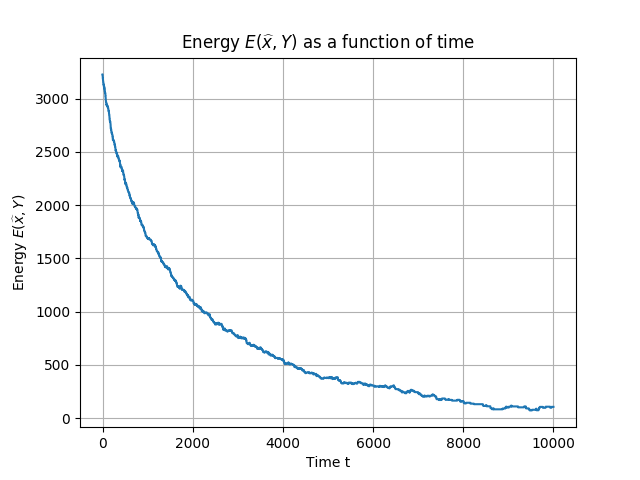

# CUDA Metropolis: A Python implementation of Metropolis on GPU

This project implements two popular MCMC method (Metropolis-Hastings and Glauber) that can be run both on CPU and GPU, using PyTorch.

The Markov Chain Monte-Carlo (MCMC) method is applied here to a generalized linear estimation problem. Given a known matrix W of dimension m × n, we would like to recover the vector X = (X1, ... , Xn)^T ∈ S = {−1, 1}^n from the vector of observations: Y = 1/n * ReLU(WX).



## Performance gain

|                   |       1 run           |      100 runs         |
| ----------------- |:---------------------:|:---------------------:|
| One run at a time | **1.08 s ± 2.93 ms**  | 1min 48s ± 303 ms     |
| Batchwise (CPU)   | 2.09 s ± 7.72 ms      | 43.5 s ± 244 ms       |
| Batchwise (GPU)   | 6.72 s ± 16.5 ms      | **9.91 s ± 6.15 ms**  |

*Execution time comparison of the Metropolis algorithm with tmax = 10, 000, N = 1000 and M = 5000 using the standard one run at a time implementation and batchwise computations.*


## Installation
To install all the required dependencies, run the command `pip install -r requirements.txt`.

## Usage
To run an experiment, instantiate an `Experiment` object by providing the values of `N`, `M`, `t_max` and the cooling strategy (`BetaScheduler` subclass). Optionnally, you can specify the algorithm to use ("Metropolis" or "Glauber"), wheter to execute the program one run at a time (`batch_size = None`) or batchwise (e.g. `batch_wise=10`) and wheter to run the program on GPU or not (you can verify that PyTorch recognizes the GPU by writing `torch.cuda.is_available()`). We show below an example code, also available in the `run.py` file.

```python
from experiment import Experiment
import scheduler
import utils


experiment = Experiment(N=1000, M=5000, t_max=10000, beta_scheduler=scheduler.ConstantBetaScheduler(0.5),
                        algorithm="Metropolis", batch_size=None, use_gpu=False)
errors, energies, x = experiment.run()
utils.plot_errors_energies(errors, energies)
```

## About the MCMC method

Since every entry in X can take only two values, this is a discrete optimization problem and solving it by a brute force approach becomes computationally infeasible as soon as n becomes large. We can use the MCMC method to construct a Markov chain that samples from the Gibbs-Boltzmann distribution p_Y(x) = 1 / Z_β * exp(-β H_Y(x)), x ∈ S$$

When β is sufficiently large, the vectors x that minimize the energy function correspond to peaks in this distribution. Vectors x will be close to the ground-truth vector X.
